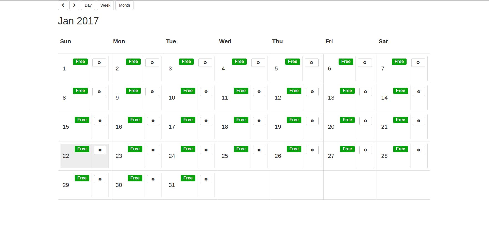

# Angular2-Calendar




## About

A calendar component for angular 2.0+ that can display events on a month, week or day view. The successor of: https://github.com/Big-Silver/angular2-calendar.git
 This calendar example is written by [Big Silver].

## Technology

 It uses the the following technologies:
<ul>
<li>Angular2</li>
<li>Redux</li>
<li>@ngrx/store</li>
<li>Typescript</li>
</ul>

## Quick Start


```bash
# clone our repo
$ git clone https://github.com/Big-Silver/angular2-calendar.git angular2-calendar

# change directory to your app
$ cd angular2-calendar

# install the dependencies with npm
$ npm install

# start the server
$ npm start
```
go to [http://localhost:8080](http://localhost:8080) in your browser.
